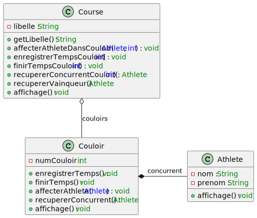

# TP1

# Informations
Nom : REHUA
Prénom : Manuvai

Lien vers le dépôt Github : https://github.com/manuvai/M2_MIAGE_IPM_POO_TP1

# 1. Diagramme de classes

# 2. Première classe à définir
La première classe à définir est la classe `Athlete` car elle possède le moins de liaison avec des objets complexes.
